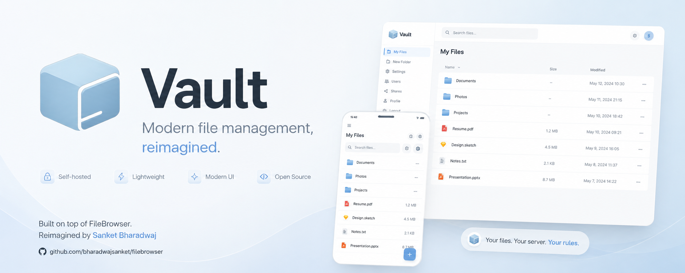

# Vault

<p align="center">
  
</p>

<p align="center">
  Modern file management, reimagined.
</p>


Vault is a modern redesign of FileBrowser focused on clean visuals, improved usability, and a refined self-hosted file management experience.

## Why Vault

- Modern UI with a cleaner presentation
- Improved mobile-friendly layout and controls
- Lightweight self-hosted deployment
- Developer-friendly CLI and configuration
- Built on top of FileBrowser with compatible runtime behavior
- Not a replacement for Nextcloud, Dropbox, Google Drive, Synology, or CasaOS

## Features

- Browse files and folders
- Upload, download, rename, move, and delete files
- Create folders and new files
- Search for files
- User management and permissions
- File previews for images and text
- Dark mode support
- Quick setup for first-time database initialization
- Supported environment-based and config-file configuration


## Quick Start

Build the frontend assets and the binary from source:

```bash
cd frontend
pnpm install --frozen-lockfile
pnpm run build
cd ..
go build -o vault .
```

Run Vault in the current directory:

```bash
./vault -r .
```

Then open `http://127.0.0.1:8080` in your browser.

## Usage

Vault can be configured via CLI flags, environment variables, or a config file.

Common options:

- `-c, --config` : path to configuration file
- `-d, --database` : path to the database file (default: `./vault.db`)
- `-r, --root` : root directory to serve (default: current working directory)
- `-a, --address` : address to bind (default: `127.0.0.1`)
- `-p, --port` : port to listen on (default: `8080`)
- `--cacheDir` : local cache directory for file previews and thumbnails
- `--redisCacheUrl` : Redis URL for upload cache
- `--disableExec` : disable the command runner feature
- `--disableThumbnails` : disable image thumbnails
- `--disablePreviewResize` : disable preview resizing
- `--disableImageResolutionCalc` : disable image resolution calculation
- `--tokenExpirationTime` : session timeout (default: `2h`)

Legacy `FB_*` environment variables are accepted for compatibility, but new deployments should use `VAULT_*`.

## Configuration

Vault looks for configuration files named `.vault.json`, `.vault.toml`, `.vault.yaml`, or `.vault.yml` in these locations:

- current directory
- `$HOME`
- `/etc/vault/`

It also supports the legacy `.filebrowser` filename for backward compatibility.

Example environment variables:

```bash
export VAULT_ROOT=/srv
export VAULT_PORT=8080
export VAULT_DATABASE=/srv/vault.db
export VAULT_REDIS_CACHE_URL=redis://127.0.0.1:6379
export VAULT_DISABLE_EXEC=true
```

## Development

This repository uses Go for the backend and a Vue/Vite frontend.

From the repository root:

```bash
cd frontend
pnpm install --frozen-lockfile
pnpm run build
cd ..
go test ./...
go build -o vault .
```

Frontend tests and linting are available in `frontend/package.json`:

```bash
cd frontend
pnpm run test
pnpm run lint
```

## Credits

Vault is a modern redesign of [FileBrowser](https://github.com/filebrowser/filebrowser), a project originally created and maintained by [Henrique Dias (@hacdias)](https://github.com/hacdias).

FileBrowser is a finished product on maintenance-only mode. For more details on the original project's status, please read [@hacdias' personal reflection](https://hacdias.com/2026/03/11/filebrowser/).

**Vault Design & Redesign:** Sanket Bharadwaj ([github.com/bharadwajsanket](https://github.com/bharadwajsanket))

**Original FileBrowser Contributors:** The FileBrowser project has been built and maintained by [240+ contributors](https://github.com/filebrowser/filebrowser/graphs/contributors).

## License

Vault is licensed under the [Apache License 2.0](LICENSE), same as FileBrowser.
